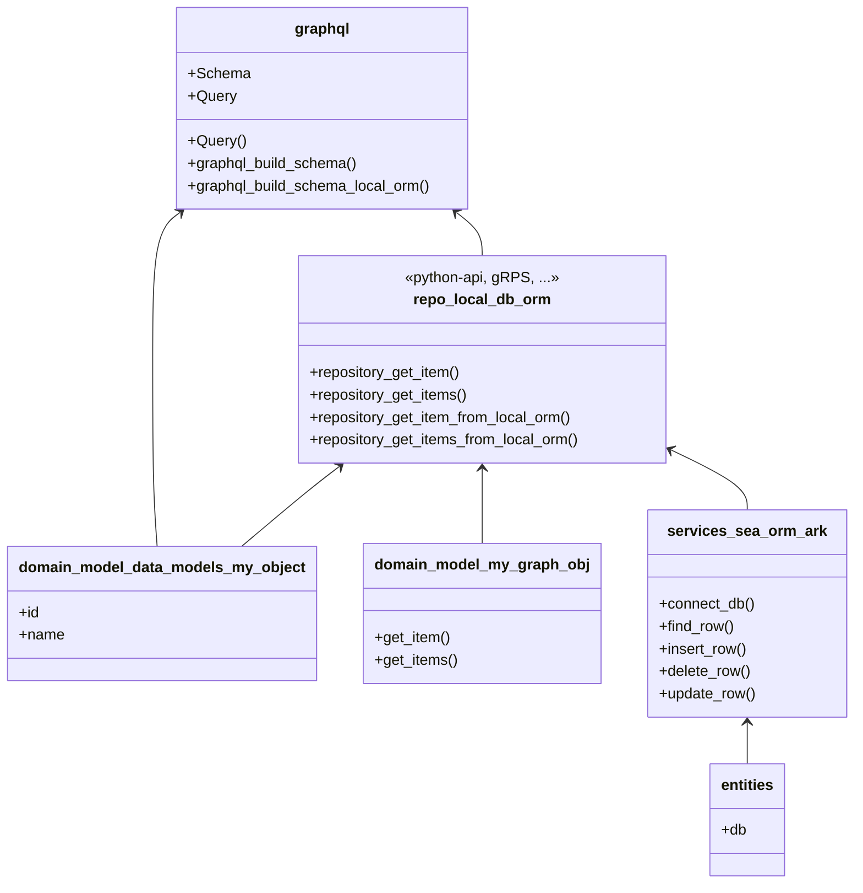

# ProjectSmartShop

```mermaid
classDiagram
    
    class domain_model_data_models_my_object {
        +id
        +name
    }

    class domain_model_my_graph_obj {
        +get_item()
        +get_items()
    }

    class repo_local_db_orm {
        <<python-api, gRPS, ...>>
        +repository_get_item()
        +repository_get_items()
        +repository_get_item_from_local_orm()
        +repository_get_items_from_local_orm()
    }
    repo_local_db_orm<--services_sea_orm_ark
    repo_local_db_orm<--domain_model_data_models_my_object
    repo_local_db_orm<--domain_model_my_graph_obj
    
    class services_sea_orm_ark {
        +connect_db()
        +find_row()
        +insert_row()
        +delete_row()
        +update_row()
    }
    services_sea_orm_ark<--entities


    class entities {
        +db
    }

    class graphql {
        +Schema
        +Query
        +Query()
        +graphql_build_schema()
        +graphql_build_schema_local_orm()
    }
    graphql<--domain_model_data_models_my_object
    graphql<--repo_local_db_orm

    
```

